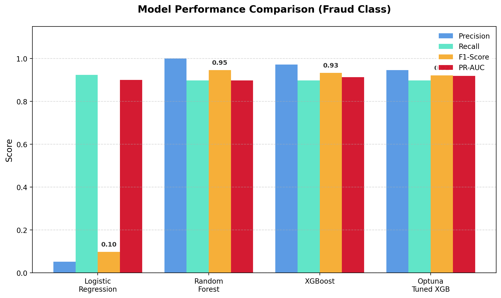
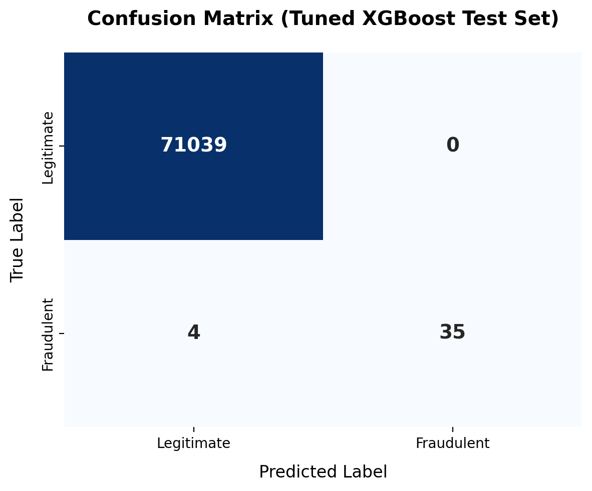
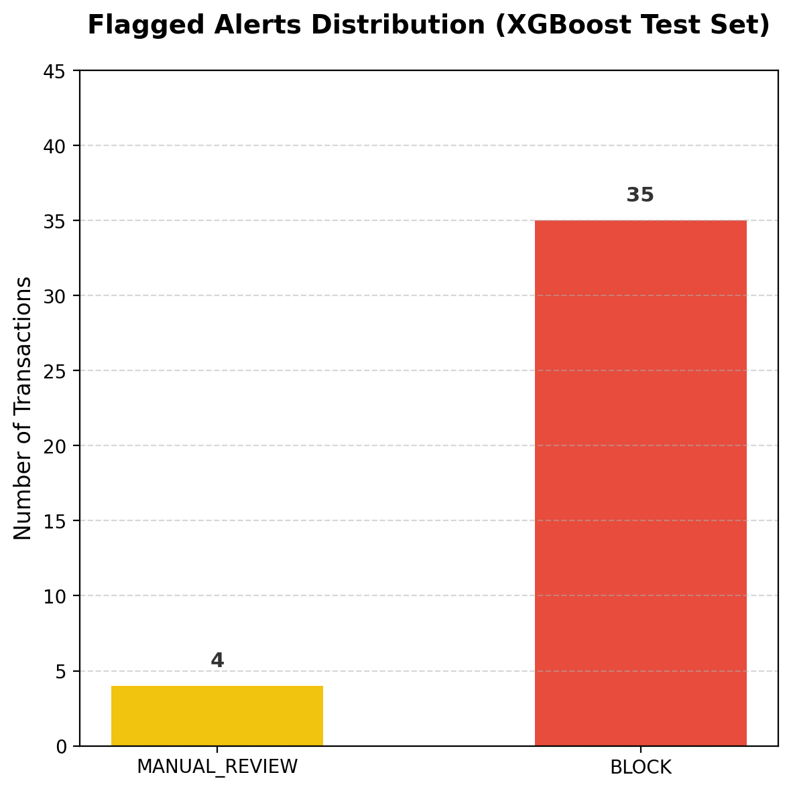
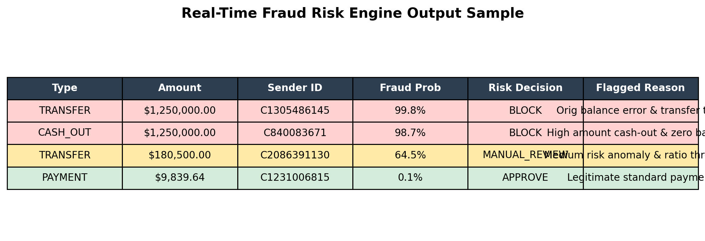
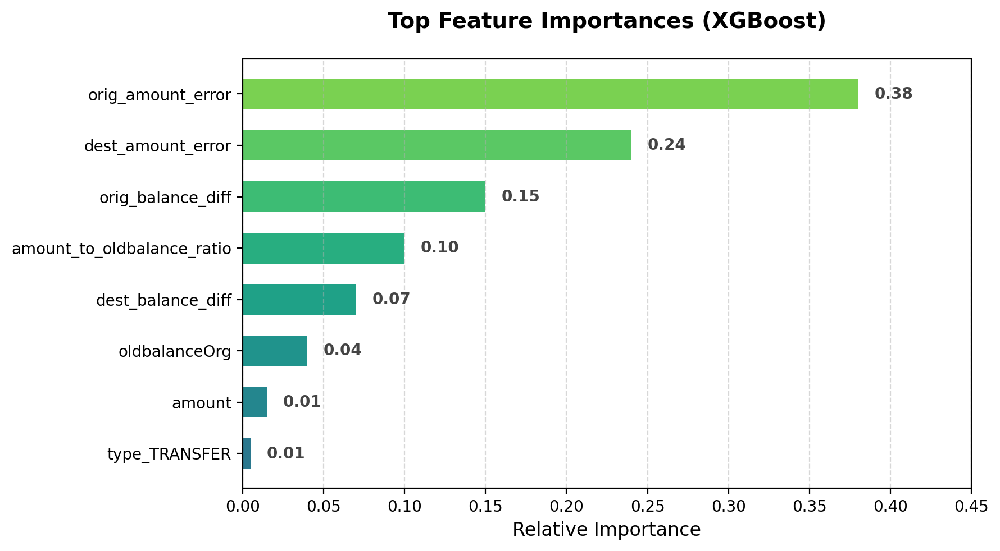

# Real-Time Digital Payment Fraud Detection System

## Project Overview

This project is an end-to-end machine learning solution for detecting fraudulent digital payment transactions. The system analyzes transaction behavior, detects suspicious patterns, predicts fraud probability, and assigns each transaction into a business risk category:

- **APPROVE**
- **MANUAL_REVIEW**
- **BLOCK**

The project uses machine learning, feature engineering, threshold tuning, hyperparameter optimization, and explainable AI to make fraud detection more practical and business-friendly.

---

## Final Result

The final Optuna-tuned XGBoost model with threshold tuning achieved:

- **Precision:** 100%
- **Recall:** 90%
- **F1-score:** 95%
- **False Positives:** 0
- **Fraud Detected:** 35 out of 39

This is the part recruiters will notice quickly.

---

## Problem Statement

Digital payment fraud is a major challenge for banks, fintech companies, and online payment platforms. Fraudulent transactions are usually rare compared to normal transactions, making this a highly imbalanced classification problem.

The goal of this project is to build a fraud detection system that can:

- Identify fraudulent transactions
- Reduce false positives
- Provide fraud probability scores
- Assign business-level risk decisions
- Explain why a transaction is considered risky

---

## Dataset

The dataset used is the **Synthetic Financial Dataset for Fraud Detection**, also known as the **PaySim dataset**.

The dataset contains simulated mobile-money transactions with sender and receiver balance information.

### Dataset Columns

| Column | Description |
|---|---|
| `step` | Time step of the transaction |
| `type` | Type of transaction: CASH_OUT, PAYMENT, CASH_IN, TRANSFER, DEBIT |
| `amount` | Transaction amount |
| `nameOrig` | Sender account ID |
| `oldbalanceOrg` | Sender balance before transaction |
| `newbalanceOrig` | Sender balance after transaction |
| `nameDest` | Receiver account ID |
| `oldbalanceDest` | Receiver balance before transaction |
| `newbalanceDest` | Receiver balance after transaction |
| `isFraud` | Target variable, where 1 = fraud and 0 = non-fraud |
| `isFlaggedFraud` | Existing system fraud flag |

---

## Project Workflow

```text
Data Loading
     ↓
Data Understanding
     ↓
Exploratory Data Analysis
     ↓
Data Preprocessing
     ↓
Feature Engineering
     ↓
Model Training
     ↓
Model Comparison
     ↓
Hyperparameter Tuning
     ↓
Threshold Tuning
     ↓
Fraud Risk Decision System
     ↓
Model Explainability
```

---

## Exploratory Data Analysis

The EDA focused on understanding fraud patterns in the dataset.

Key checks performed:

- Dataset shape and column information
- Missing values and duplicate rows
- Fraud vs non-fraud distribution
- Transaction type distribution
- Fraud count by transaction type
- Fraud rate by transaction type
- Transaction amount analysis
- Balance relationship analysis
- Fraud behavior over time
- Sender and receiver account analysis

### Key EDA Insights

- The dataset is highly imbalanced.
- Fraud transactions are much fewer than normal transactions.
- Fraud is mainly concentrated in transaction types such as `TRANSFER` and `CASH_OUT`.
- Balance-related features are highly useful for detecting suspicious behavior.
- The `isFlaggedFraud` column contained only zero values in the used data, so it was removed from model training.

---

## Feature Engineering

Several fraud-related features were created using transaction amount and balance columns.

### Engineered Features

```python
orig_balance_diff = oldbalanceOrg - newbalanceOrig
dest_balance_diff = newbalanceDest - oldbalanceDest

orig_amount_error = amount - orig_balance_diff
dest_amount_error = amount - dest_balance_diff

log_amount = log1p(amount)

orig_zero_balance_after = 1 if newbalanceOrig == 0 else 0

amount_equals_oldbalance = 1 if amount == oldbalanceOrg else 0

amount_to_oldbalance_ratio = amount / (oldbalanceOrg + 1)
```

These features helped capture abnormal balance movements and account-emptying behavior.

---

## Data Preprocessing

The following preprocessing steps were performed:

- Removed missing rows
- Removed unnecessary ID columns:
  - `nameOrig`
  - `nameDest`
- Removed `isFlaggedFraud` because it had no useful variation
- Converted `isFraud` to integer type
- Applied one-hot encoding to the `type` column
- Split the data into training and testing sets using stratified sampling
- Applied feature scaling for Logistic Regression

---

## Models Used

Three machine learning models were trained and compared:

1. **Logistic Regression**
2. **Random Forest**
3. **XGBoost**

Optuna was also used for hyperparameter tuning of the XGBoost model.

---

## Model Comparison

| Model | Accuracy | Precision | Recall | F1 Score | ROC-AUC | PR-AUC |
|---|---:|---:|---:|---:|---:|---:|
| Logistic Regression | 0.9907 | 0.0517 | 0.9231 | 0.0980 | 0.9838 | 0.9003 |
| Random Forest | 0.9999 | 1.0000 | 0.8974 | 0.9459 | 0.9486 | 0.8975 |
| XGBoost | 0.9999 | 0.9722 | 0.8974 | 0.9333 | 0.9817 | 0.9128 |
| Optuna-tuned XGBoost | 0.9999 | 0.9459 | 0.8974 | 0.9211 | 0.9694 | 0.9187 |

<p align="center">
  
</p>

---

## Final Model

The final selected model was:

```text
Optuna-tuned XGBoost with threshold tuning
```

Although Random Forest achieved the highest F1-score, the tuned XGBoost model achieved the best PR-AUC, which is important for imbalanced fraud detection problems.

---

## Threshold Tuning

The default classification threshold of `0.50` was not directly used as the final decision boundary. Instead, threshold tuning was applied using the precision-recall curve.

After threshold tuning, the model achieved strong fraud detection performance.

### Final Classification Report

```text
              precision    recall  f1-score   support

           0       1.00      1.00      1.00     71039
           1       1.00      0.90      0.95        39

    accuracy                           1.00     71078
   macro avg       1.00      0.95      0.97     71078
weighted avg       1.00      1.00      1.00     71078
```

### Final Confusion Matrix

```text
[[71039     0]
 [    4    35]]
```

<p align="center">
  
</p>

### Interpretation

The final tuned model:

- Correctly detected **35 fraud transactions**
- Missed **4 fraud transactions**
- Produced **0 false positives** on the test set

This means the model achieved:

- **Precision:** 100%
- **Recall:** 90%
- **F1-score:** 95%

---

## Fraud Risk Decision System

Instead of only predicting fraud or non-fraud, the system converts fraud probability into business decisions.

| Fraud Probability | Decision |
|---:|---|
| Low probability | APPROVE |
| Medium probability | MANUAL_REVIEW |
| High probability | BLOCK |

<p align="center">
  
</p>

Example logic:

```python
def fraud_risk_decision(probability):
    if probability >= block_threshold:
        return "BLOCK"
    elif probability >= review_threshold:
        return "MANUAL_REVIEW"
    else:
        return "APPROVE"
```

This makes the model output more useful for real-world fraud monitoring.

---

## Fraud Reason Generation

The system also provides simple fraud reasons for risky transactions.

Example reasons:

- High ML fraud probability
- High transaction amount
- Origin account balance became zero
- Transaction amount close to origin balance
- Transfer transaction type
- Cash-out transaction type

<p align="center">
  
</p>

This improves interpretability for fraud analysts.

---

## Model Explainability

Model explainability was added using:

- XGBoost feature importance
- SHAP explainability

<p align="center">
  
</p>

SHAP was used to understand:

- Which features influenced the model globally
- Why a specific transaction was predicted as high-risk
- Which features increased or decreased fraud probability

---

## Tech Stack

- Python
- Pandas
- NumPy
- Matplotlib
- Scikit-learn
- XGBoost
- Optuna
- SHAP
- Joblib

---

## Project Structure

```text
fraud-detection-project/
│
├── data/
│   └── raw/
│
├── notebooks/
│   └── fraud_detection_project.ipynb
│
├── models/
│   ├── xgb_fraud_model.pkl
│   └── best_threshold.pkl
│
├── reports/
│   └── figures/
│
├── README.md
├── requirements.txt
└── app.py
```

---

## How to Run the Project

### 1. Clone the repository

```bash
git clone https://github.com/DivyanshuHeroo/fraud-detection-project.git
cd fraud-detection-project
```

### 2. Install dependencies

```bash
pip install -r requirements.txt
```

### 3. Add dataset

```download the PaySim dataset and place the CSV file inside:
data/raw/
```

### 4. Run the notebook

Open and run:

```text
notebooks/fraud_detection_project.ipynb
```

---

## Requirements

Example `requirements.txt`:

```text
pandas
numpy
matplotlib
scikit-learn
xgboost
optuna
shap
joblib
```

---

## Business Impact

This project demonstrates how machine learning can support fraud detection in digital payment systems.

The solution can help financial institutions:

- Detect suspicious transactions
- Reduce fraud losses
- Reduce unnecessary false alarms
- Support fraud analysts with risk explanations
- Convert model predictions into business decisions

---

## Limitations

- The dataset is synthetic, not real banking data.
- Some engineered features are highly predictive because PaySim contains strong balance-based fraud patterns.
- The model should be validated on real-world transaction data before production use.
- Thresholds should be selected based on business cost, fraud risk, and customer experience.

---

## Future Improvements

Possible future improvements include:

- Build a Streamlit dashboard
- Add FastAPI for real-time fraud prediction
- Use graph-based fraud detection
- Add customer-level transaction history features
- Add device, IP, and location-based fraud signals
- Monitor model drift over time
- Deploy the model using Docker or cloud services

---

## Final Conclusion

This project successfully built an end-to-end digital payment fraud detection system using machine learning and explainable AI.

The final system detects fraudulent transactions, assigns fraud risk decisions, and provides human-readable reasons for suspicious activity. The project demonstrates practical skills in data analysis, feature engineering, model training, hyperparameter tuning, threshold optimization, and fraud risk decisioning.

---

## Resume Summary

Built an end-to-end digital payment fraud detection system using XGBoost, Optuna hyperparameter tuning, threshold optimization, and SHAP explainability to classify transactions into approve, manual review, and block risk categories.
